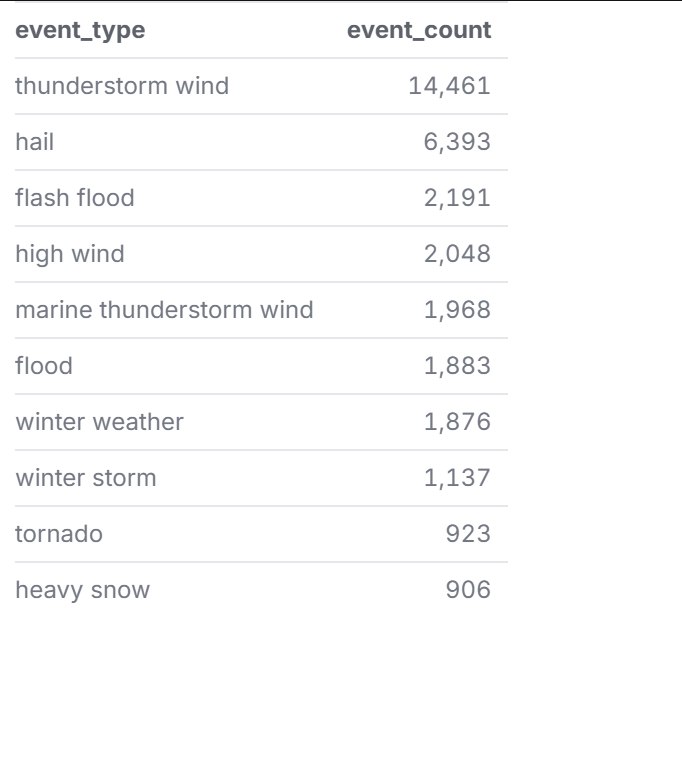
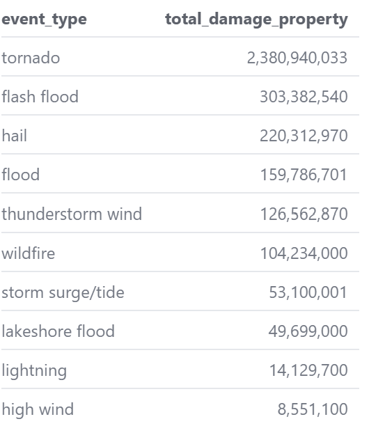
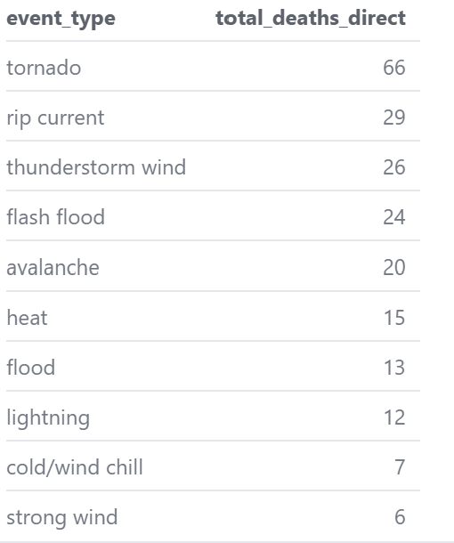
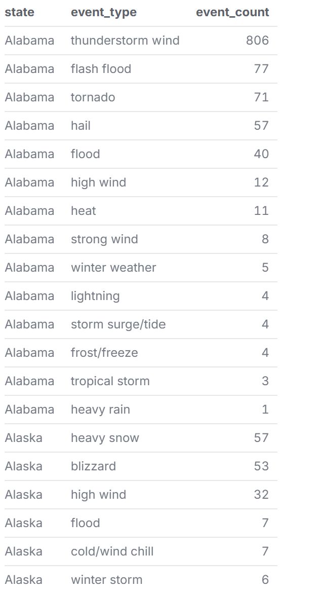
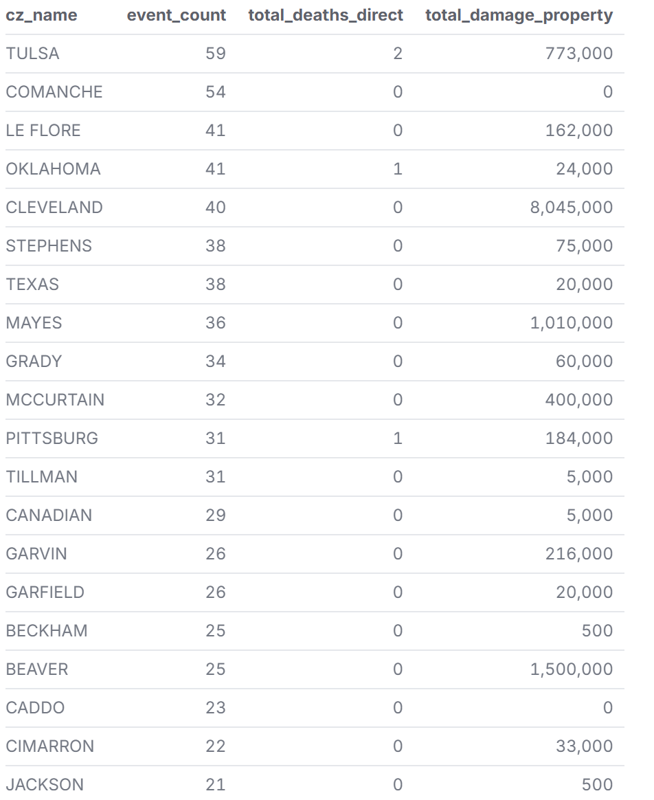

# Storm Events 2020 - Analysis

## Introduction
I chose to analyze NOAA Storm Data in 2020, which I got from Kaggle, as I’ve always been interested in weather due to my experiences in Central Texas. In Texas, I’ve experienced winter storms, hailstorms, and tornadoes, not just in Texas, but in Kansas, where I have family. 

## Findings

### Storm Types

To start, this section will analyze storm types based on the idea of frequency vs danger, as thunderstorm wind was the most common storm event at 14,461, but it is not the most destructive weather event in 2020. The first question I put into VS Code was for the top 10 most frequent storm types, with thunderstorm wind at 14,461, hail at 6,393, and flash floods at 2,191. The second question is the total property damage by storm type, with tornadoes having the most property damage at 2,380,940,033, and high winds having the least. In terms of deadliest storm types, tornadoes topped the list at 66 deaths, followed by rip currents at 29. I predicted that tornadoes would cause the most deaths and property damage due to their destructive nature and how they can easily tear a structure apart. I thought it was interesting that the NOAA Storm data separates thunderstorm wind vs marine thunderstorm wind, as I had never heard of marine thunderstorm wind and thought that it would be grouped. 

**Question 1: What are the top 10 most frequent storm types?**

**Question 2: What is the total property damage by storm type?**

**Question 3: What are the deadliest storm events?**

### Geography

The next section is geography, in which the overall question is to analyze where storms hit the hardest, with a further analysis on Texas, Oklahoma, and Kansas, as they’re part of Tornado Alley. The first graph shows the states with the most storm events, led by Texas at 2,843, followed by South Dakota at 1,544 and Kansas at 1,308. The next question focuses on the number of event types by state. For example, Alabama has had 806 instances of thunderstorm wind, while Arizona has had three instances of dust devils. I conducted a deeper analysis of counties in Texas, Oklahoma, and Kansas by examining event counts, total direct deaths, and total property damage, as I often spend time driving between these three states. 
 
**Question 1: Which states had the most storm events in 2020?**

**Question 2: How many different event types occurred in each state?**

**Question 3: How many storm events, total deaths, and property damage were there in Texas counties in 2020?**

**Question 4: How many storm events, total deaths, and property damage were there in Kansas counties in 2020?**

**Question 5: How many storm events, total deaths, and property damage were there in Oklahoma counties in 2020?**

